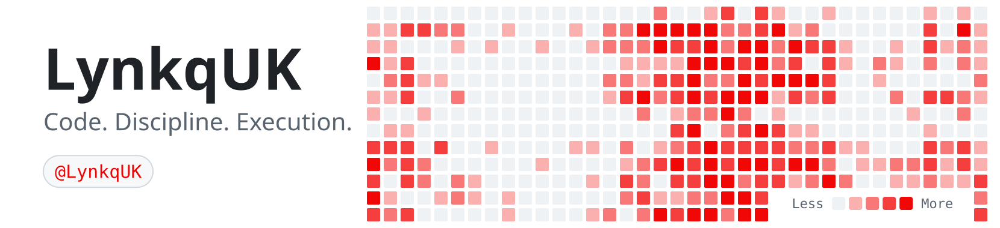
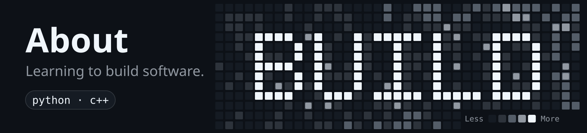
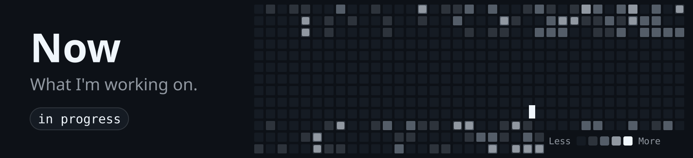
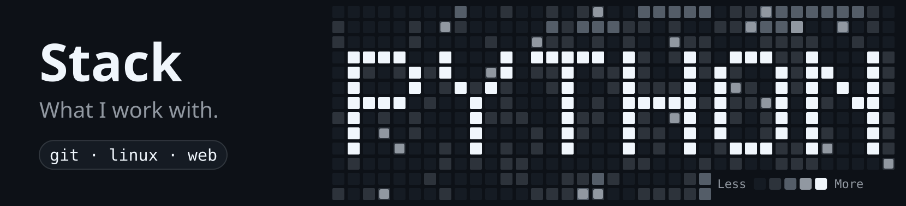
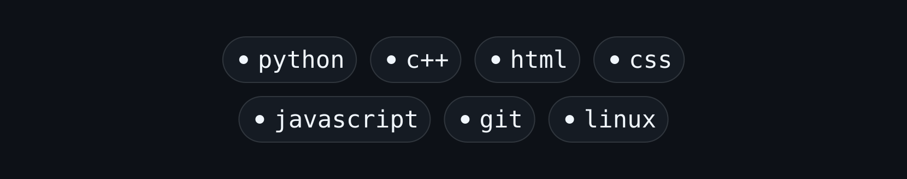
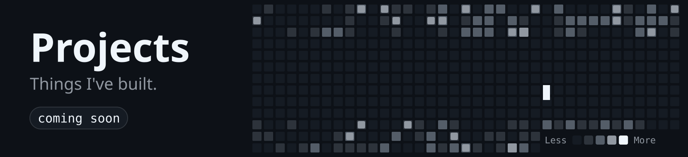
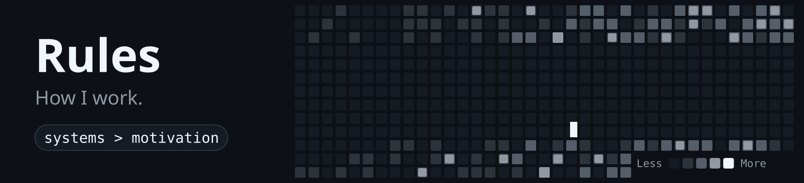
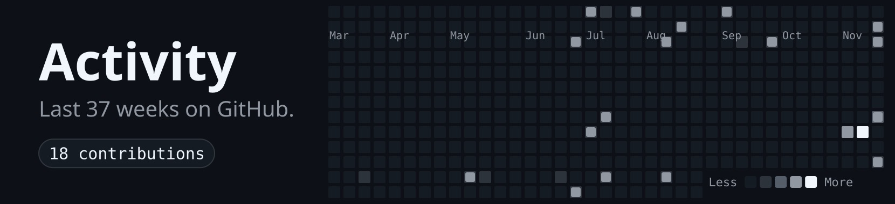
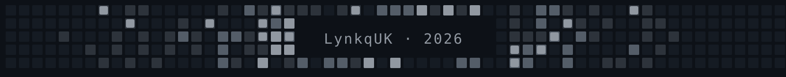

<!-- Everything below is generated. To change the words, edit .github/banners.json and commit: the banners rebuild themselves. -->

<picture>
  <source media="(prefers-color-scheme: dark)" srcset="art/header-dark.svg">
  
</picture>

  

<h3>I lift heavy things, move wooden pieces and argue with compilers. Not always in that order.</h3>

Student. Part-time chess player, full-time overthinker. 
I like problems that fight back: a bug that only shows up at 2 a.m., a chess endgame, a proof that looks wrong until it suddenly doesn't. 
Right now I'm turning "I watched a tutorial" into "I shipped it".

 

  

  

  

  

  

  

  

  

  

  

<h2>Hot takes</h2>

<b>Tabs or spaces?</b>
 Whatever the formatter says. Arguing about it is a tax on your time.  

<b>Best programming language?</b>
 Ask me again after the next project. It changes every time I learn something new.  

<b>Clever code or readable code?</b>
 Readable. Future me is a stranger who hates present me.  

<b>Motivation or discipline?</b>
 Neither. Systems. Motivation shows up late, discipline gets tired, a good routine just runs.  

<b>Sleep?</b>
 A feature I keep meaning to enable.  

 

<h2>Talk to me</h2>

<b>Got a problem worth solving, a project that needs a second brain, or a chess game to lose?</b> 
Show me what you've tried first, then we'll get along fine. 
Fastest way to reach me is Discord, button below.

  

  

  

<!--
More links, when you are ready: fill in your handles and remove the comment markers around this block.

-->
